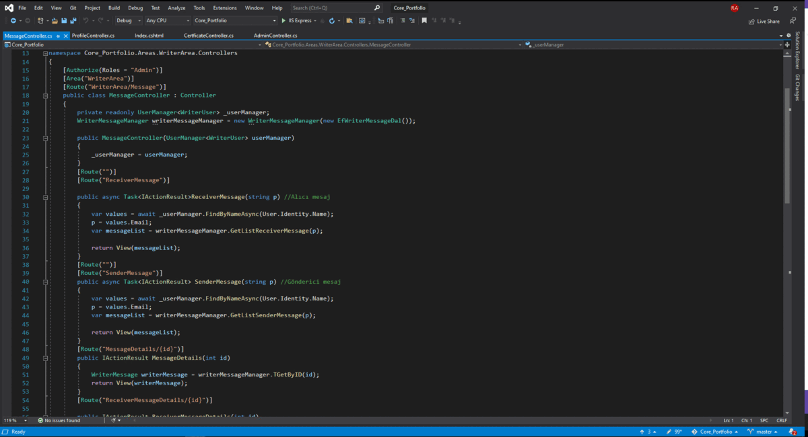

# Core Portfolio Project


I developed a CV related website. I used layered architecture on this website. I used N-tier architecture.

## Layers Used in the Project

* Business Layer
* Presentation Layer 
* Entitiy Layer
* Data access Layer

I created folders within these layers and created my abstract and concrete classes. For abstract classes, I created folders named Concrete for abstract concrete classes.
I used MsSql as database.

## Technologies Used in the Project

* Asp.net Core 5.0
* Entity Freamwork Core
* Entity Freamwork Tools
* Entity Freamwork Design
* Entity Freamwork Sql Server
* API
* Ajax
* Fluent Validation
* JSON
* ASP.NET Core Identity
* Area
* Role

## Project Setup
* First you need to [install](https://visualstudio.microsoft.com/tr/).

* You must select the ASP.NET Web Application (.NET Framework) option and select the version. Ins. I developed the project with version 4.6.1.

* After choosing your project name and version, a screen comes up where you can choose how to develop the application in the next step. Since we will use MVC, we choose the MVC option.

* Check MsSQL as datastore. I created my classes in Model. I submitted this to the database.

## What is included in the project?

* My project consists of 3 different pages. These pages are the homepage where my cv site appears, the admin panel for the admin to manage the site, and finally a separate panel for the users. In this panel; Incoming notifications, messages I send privately or there are areas where members can write private messages to me.

* First, I created the controllers that will appear on my homepage. I wrote basic CRUD operations in these controllers and in addition, I created special interfaces where I need filtering myself.

* I used the Area structure, which is a new feature that comes with Asp.net Core, for the first time in this project. This folder structure creates an MVC area in itself. In this folder, I created MVC structure such as Login and Register for users.

* I used the View Components structure, which is one of the new updates that came with ASP.NET Core 5.0, in this project. In this way, I have reduced the use of partial view and aimed to reduce the load and cost on the controller.

* In this project, I created the visual insertion fields dynamically, not statically, so for example, after changing your profile photo, there is an area where you can see the change in the interface. Changed images are kept in the folder.


---


---


* I developed an area where users can message me and I can send private messages to them.
       - Since I keep user records with Identity, I brought data by name.
       - I have developed an area where the sender and the receiver can message, so that the admin can send a message to his members, and the members can send a message to the admin.



* It is the admin panel, which is indispensable for a project. I designed this panel as an area where I can easily perform and execute many operations. In short, it is an area where you can do all basic CRUD operations.


* I used AJAX structure for the Experience field. In this way, I have created an area that can update the page faster and make it load.


* I worked with the API to take the temperature data of the city where they are located on the page I made specifically for the users and present it to them. Thanks to the weather API, I pulled the data to my site.


* Since I started using multiple models, I used the Data Transfer Object (DTO) layer to avoid confusion. In this way, the models became cleaner and more descriptive.

* Since this is a CV site, I actually thought that having a page for users would not look professional afterward, so I removed it. I used roleplaying while doing this. In other words, while I can access all pages, a user who does not have access will not be able to access that page. If it tries to access it, it will get a 401 error.


* I designed a page that will encounter a 404 error when going to an incorrect page, and I wrote the necessary parameters in the startup.cs file.


````
services.AddMvc(config =>
            {
                var policy = new AuthorizationPolicyBuilder()
                                .RequireAuthenticatedUser()
                                .Build();
                config.Filters.Add(new AuthorizeFilter(policy));
            });
            services.AddMvc();
            services.AddAuthentication(
                    CookieAuthenticationDefaults.AuthenticationScheme)
                .AddCookie(x =>
                {
                    x.LoginPath = "AdminLogin/Index/";
                });


            services.ConfigureApplicationCookie(options =>
            {
                options.Cookie.HttpOnly = true;
                options.ExpireTimeSpan = TimeSpan.FromMinutes(100);
                options.AccessDeniedPath = "/ErrorPage/Index";
                options.LoginPath = "/WriterArea/Login/Index";
            });
````

***I developed this project with the course found at [udemy](https://www.udemy.com/course/aspnet-core-5-ile-name-adim-web-development/) by [@muratyucedag](https://github.com/MuratYucedag).***
